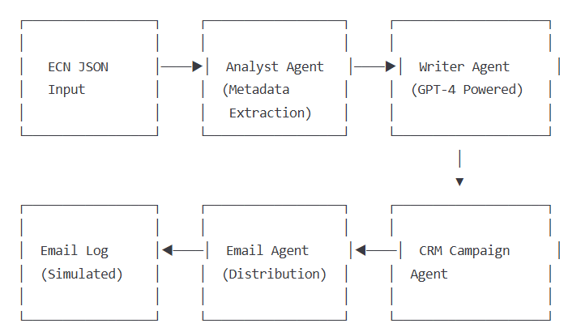

# 🤖 Multi-Agent ECN Notification Bot

[](https://www.python.org/)
[](https://platform.openai.com/)
[](https://streamlit.io/)
[](https://opensource.org/licenses/MIT)

## 🌐 Live Demo

Try the deployed app here:  
👉 [https://multi-agent-ecn-bot-d6hei4irabtv8ggtgyw8as.streamlit.app](https://multi-agent-ecn-bot-d6hei4irabtv8ggtgyw8as.streamlit.app)


This app uses GPT-4 and a multi-agent design pattern to automate Engineering Change Notice (ECN) communication. It takes a structured ECN JSON file as input, analyzes the data, drafts a customer-facing notification, builds a simulated CRM campaign, and logs email actions — all via a friendly Streamlit interface.

## 🔍 The Problem & Solution

**Problem:** Engineering Change Notices (ECNs) are critical but time-consuming Quality-related communications that are very demanding of Product Managers’ time time and are often a significant distraction from more valuable, strategic work.

**Solution:** This application automates the entire ECN communication workflow by using specialized AI agents working together to analyze changes, draft professional communications, and prepare distribution campaigns (CRM: SalesForce) - reducing manual effort by 80%, ensuring consistent quality and eliminating low-value work for Product Managers, .

## 🏗️ System Architecture

[](systemarchitecture.png)

---

## 🚀 Features

- 🧠 **Writer Agent (GPT-4):** Uses OpenAI's GPT-4 to generate professional customer notification emails.
- 📑 **Analyst Agent:** Extracts relevant metadata from ECN JSON input.
- 📬 **Email Agent:** Simulates outbound communication logs.
- 📊 **CRM Campaign Agent:** Creates a mock CRM campaign structure.
- 📄 **Document Export:** Download notification as a Microsoft Word file.
- 🖼️ **Streamlit UI:** Modern, interactive interface built for usability.
- 🔄 **Agent Orchestration:** Demonstrates collaborative AI agent workflow.

## 🖥️ Demo


*Note: Add a screenshot of your app in action to the repository.*

---

## 🧪 Example Input

```json
{
  "id": "ECN-2048",
  "summary": "Pump housing material updated to polycarbonate for durability.",
  "affected_parts": ["P123", "P124"],
  "effective_date": "2025-07-01",
  "owner": "Jane Doe (jane@example.com)"
}
```

## 💻 Run Locally

1. Clone the repository
   ```bash
   git clone https://github.com/janakybrent/multi-agent-ecn-bot.git
   cd multi-agent-ecn-bot
   ```

2. Install dependencies
   ```bash
   pip install -r requirements.txt
   ```

3. Set your OpenAI API key
   - Option 1: via environment variable
     ```bash
     export OPENAI_API_KEY="sk-..."
     ```
   - Option 2: create a `.env` file
     ```
     OPENAI_API_KEY=sk-...
     ```

4. Run the app
   ```bash
   streamlit run app.py
   ```
   The app will open in your browser at http://localhost:8501.

## 🌐 Run on Streamlit Cloud (Always Live)

1. Fork this repo
2. Go to Streamlit Cloud → New App
3. Select your repo and app.py
4. In Secrets, paste:
   ```
   OPENAI_API_KEY = "sk-..."
   ```
5. Click Deploy
6. You'll get a public URL like:
   `https://your-username-multi-agent-ecn-bot.streamlit.app`

## 🧠 Tech Stack

- **Python:** 3.10+
- **UI Framework:** Streamlit 1.24.0
- **LLM Integration:** OpenAI GPT-4 (openai==0.28.0)
- **Additional Libraries:**
  - python-docx==0.8.11 (Word document generation)
  - pyngrok==6.0.0 (Local tunneling)
  - python-dotenv==1.0.0 (Environment management)

## 🔧 Customization

The application can be customized for different organizational needs:

- **Custom Templates:** Modify `templates/` to adjust notification formats
- **Agent Behavior:** Update agent prompts in `agents/prompts.py`
- **New Agents:** Add specialized agents by extending the base agent class in `agents/base.py`

## 🛣️ Roadmap

- [ ] Add support for additional ECN format standards (AS9016, etc.)
- [ ] Implement real email integration via SMTP
- [ ] Create a dashboard for tracking notification metrics
- [ ] Add multilingual support for global organizations

## 📄 License

MIT License

## 👤 Author

**Brent Janaky**
- LinkedIn: [https://www.linkedin.com/in/brentjanaky/](https://www.linkedin.com/in/brentjanaky/)
- GitHub: [https://github.com/janakybrent](https://github.com/janakybrent)

---

*This project demonstrates skills in: Python, Streamlit, OpenAI API integration, Multi-agent systems, Business automation, UI/UX design, and documentation.*

